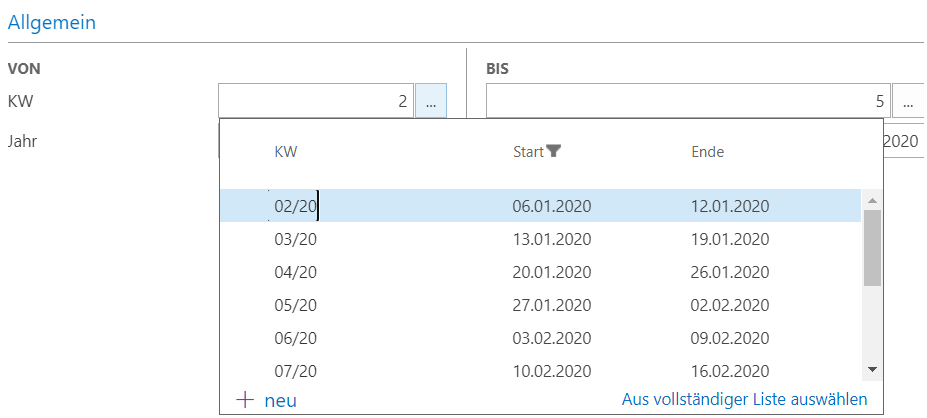

# DynamicDropDown_CalendarWeeks
Dynamic drop down dialog - Calendar Weeks (Number,From,To) - written in AL 

# HOWTO Pass parameters to the dropdown page
- the easiest way to pass parameters to the list page is via table relation property of the page field
- to pass a datefilter to the dropdown, the source table needs a DateFilter FlowField which you can include in the tablrelation

        TableRelation = DateDropDown."Period No." where("Period Start"=field("Due Date Filter"));

# HOWTO create a customized dropdown dialog
## 1. Create a table (e.g. DateDropDown) 
### - Primary Key Field Datatype must match the pagefield datatype
### - specify the dropdown fields
        fieldgroups
        {
            fieldgroup(DropDown; "Period Name","Period Start","Period End") {}
        }
## 2. Create a list page (e.g. DateDropDown) with the following properties
    PageType = List;
    SourceTable = DateDropDown;
    SourceTableTemporary = true;
## 3. Write Code (trigger OnOpenPage()) to fill the DropDown
## 4. Create a page field and assign your dropdown listpage
         field(WeekNo; WeekNo)
                        {
                            TableRelation = DateDropDown."Period No.";
                            LookupPageId = DateDropDown;
## Optimization
- Captions could be set dynamically
    - Columns via **CaptionClass**-Property of the table fields 
    - List Page Caption via **CurrPage.Caption**

